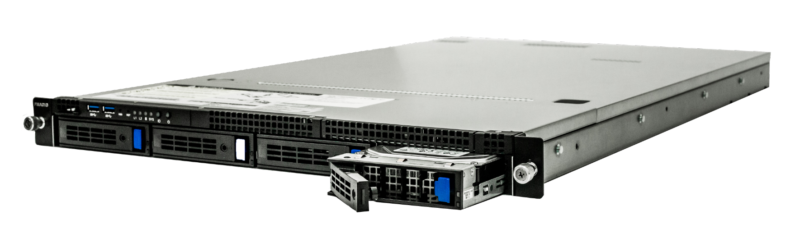
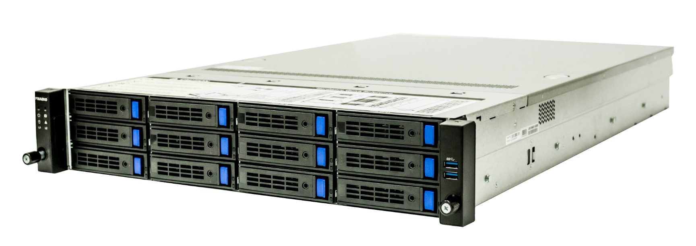
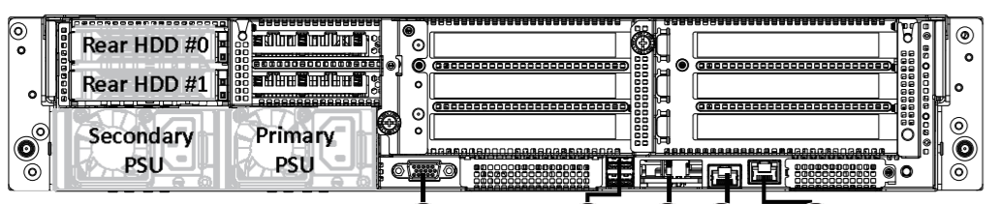
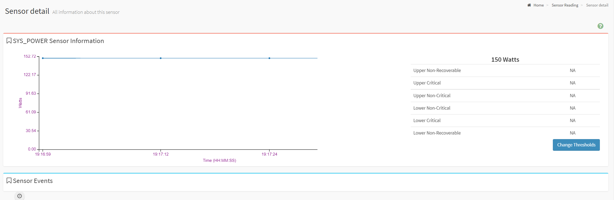
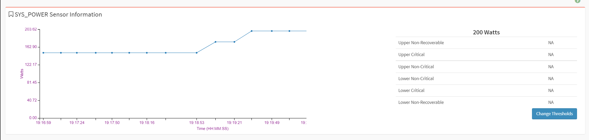
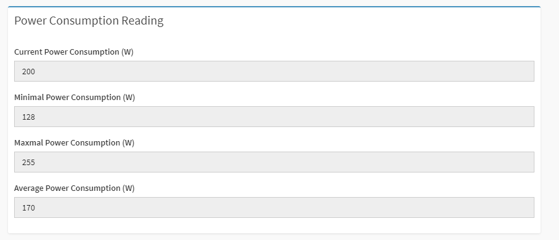

# Hardware

FMADIO 20G Gen3 1U System

FMADIO 20G Gen3 2U System

## Power Consumption

FMADIO20G Gen2 1U System

| SKU | Description | Average | Max |
| :--- | :--- | :--- | :--- |
| Capture 1U | System Idle | 150W | 300W |
| Capture 1U | Full 20Gbps Sustained Capture | 200W | 300W |
| Capture 2U | System Idle |  |  |
| Capture 2U | Full 20Gbps Sustained Capture |  |  |
| Analytics 1U | System Idle |  |  |
| Analytics 1U | Full 20GBps Sustained Capture |  |  |
| Analytics 1U | 96 CPUs maximum processing |  |  |

### 1U Capture Idle Power Consumption

FW: 7256 \(2021/7/10\)

### 1U Capture Full Capture Power consumption

FW: 7256 \(2021/7/10\)

### 1U Maximum Power Consumption

FW: 7256 \(2021/710\)

