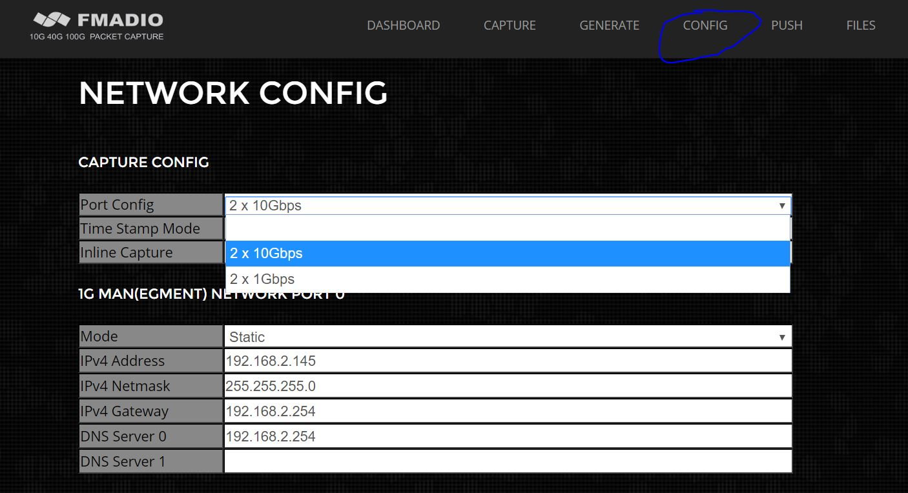
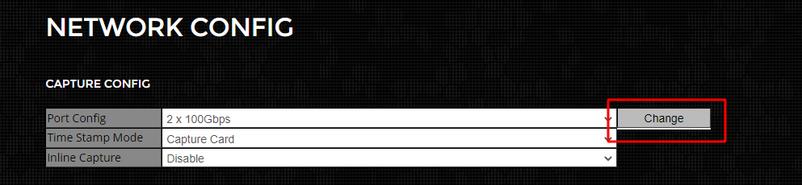
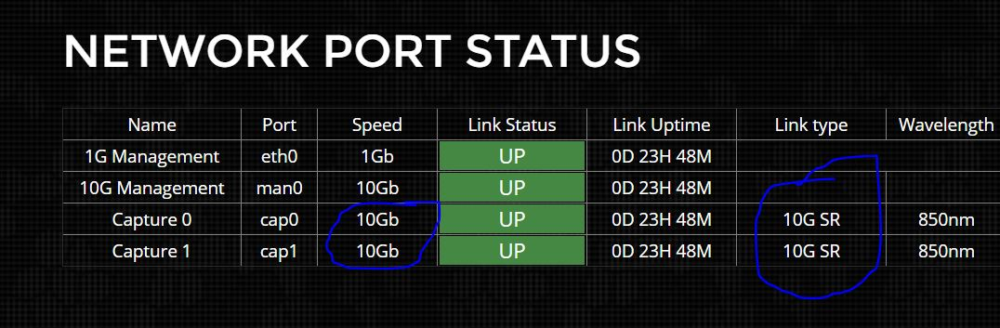

# Capture Port Link Speed

FMADIO Capture systems capture at multiple different link speeds based on the Device Model number selected, we offer all port speeds at no additional charge. The following port configurations are supported\

-- fmadio20v2 begin 
-- fmadio20v3 begin 
-- fmadio20p3 begin 

**FMADIO20v3**:
- 1x1G 
- 1x10G

-- fmadio20v2  end 
-- fmadio20v3  end 
-- fmadio20p3  end 

-- fmadio40v3  begin 
-- fmadio100v2 begin 
-- fmadio100p3 begin 

**FMADIO100v2**:
- 2x100G
- 2x40G
- 4x25G  (in progress)
- 8x10G

-- fmadio40v3  end 
-- fmadio100v2 end 
-- fmadio100p3 end 

### Configuration 

Configuring the different port speeds requires updating the FPGA NIC, which requires setting the Capture Port mode and then re-updating the devices firmware. The steps are shown below:

**Step 1)**

Select the port configuration "Config Page - > Port Config" as shown below. In this example 2x10G mode is selected.

**Step 2)**

After the port configuration has been chosen, click the "CHANGE" button to change the port speed. This will reboot the system twice as its reconfiguring the FPGA device. It will take 3-5 minutes to complete the operation

**Step 3)**

Once the update has completed, please verify the capture port configuration on the GUI dashboard, as shown below in blue.

