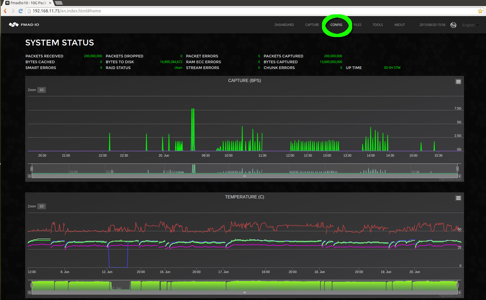
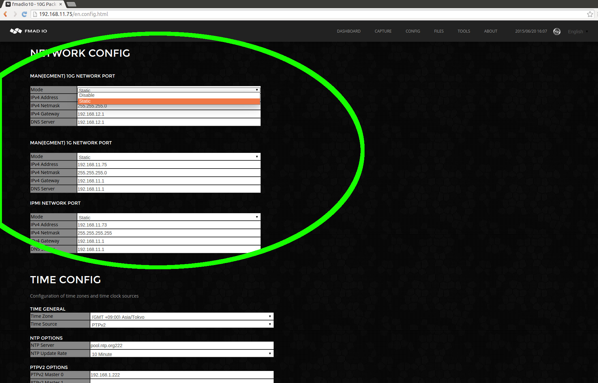
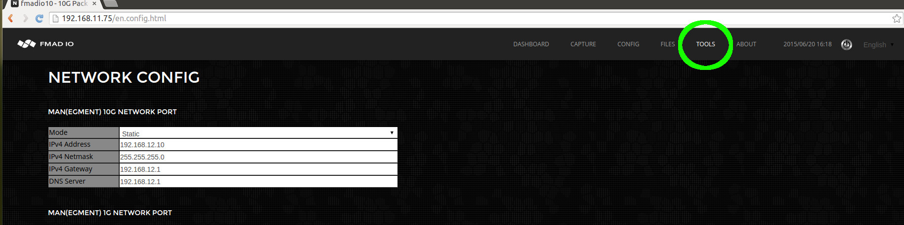
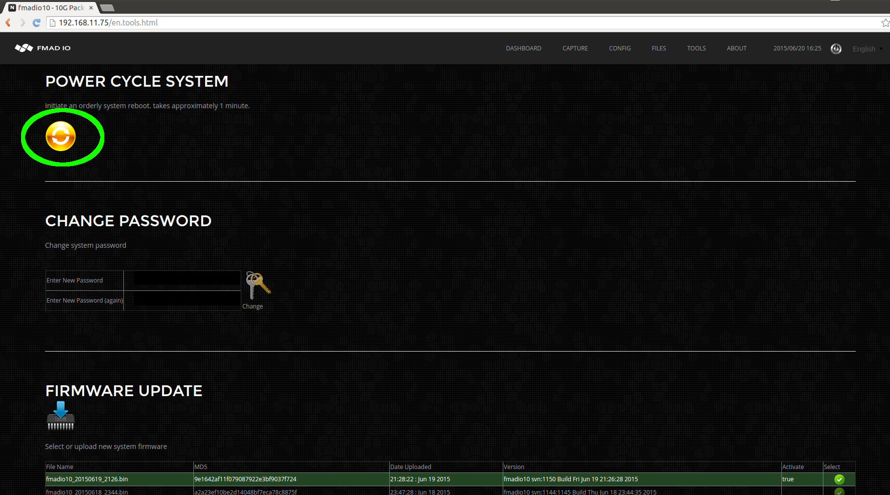

# Network Configuration (GUI)

Network port configuration can be achieved using a) the web interface, b) SSH command line interface(CLI). Using the Web interface is the easiest route, however in highly constrained network environments a pure CLI based configuration can be easier

**WEB INTERFACE: NETWORK CONFIG**

From the dashboard page, Start by selecting the configuration menu option from as shown below (highlighted in green).

Then edit the network configuration\`s IP/Netmask/Gateway/DNS setting as shown in the image below. After each field has been edited the system automatically saves and updates the system setting (save button is not required). After completing the update, refresh the web page to confirm the new settings.

Select the tools menu from the top toolbar, as shown in the image below.

And finally select the Power Cycle / Reboot button to restart the system

