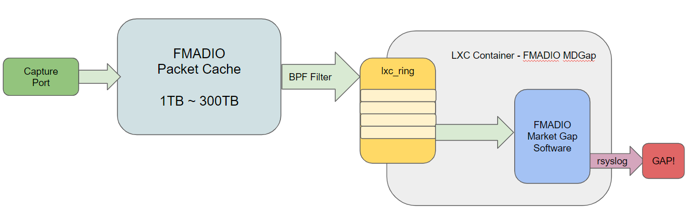

## Market Data Gap Detection ##

FMADIO Capture system allows al full market data gap detection to run on the capture system itself. This enables data loss checks on all market data links to ensure every single byte and bit of data has been correctly captured and stored.


The project is fully open source under an MIT license, we heavily utilize the Open Markets Initative codebase for formatting and parsing protocols

FMADIO Market Data Gap Github Project

By default the gap detector runs in an LXC container, this container is built and downloaded in the following location

## (/release)

Once installed the system uses the PCAP Push functionality of the system that writes (optionally) filtered PCAP data into an internal ring buffer. That packet ring buffer is passed to the LXC MDGap container, which in-turn pulls data off the ring and processes it.

A high level overview is shown below
 


FMADIO Market Gap Detector

Alerts are output to syslog allowing a range of options for monitoring and reporting infrastructure. 

Example of the gap detector Alert output is as follows

```
Oct 05 12:57:31 mdgap-20220927 fmadio[90884]: {"module":"market-data-gap","subsystem":"gap"        ,"timestamp":1664974651.203,"PCAPTime":"2017.09.07_14:10:18.942.837.551","PCAPTS":1504793418,"Protocol":"./omi/siac/Siac.Opra.Recipient.Obi.v4.0.h","Session":"233. 43.202. 52:udp: 12120 ","GapSize":1,"SeqExpect":27766229,"SeqFound":27766230}
```

Example syslog Alert 

in pretty json format style

```json
{
  "module": "market-data-gap",
  "subsystem": "gap",
  "timestamp": 1664974651.203,
  "PCAPTime": "2017.09.07_14:10:18.942.837.551",
  "PCAPTS": 1504793418,
  "Protocol": "./omi/siac/Siac.Opra.Recipient.Obi.v4.0.h",
  "Session": "233. 43.202. 52:udp: 12120 ",
  "GapSize": 1,
  "SeqExpect": 27766229,
  "SeqFound": 27766230
}
```

